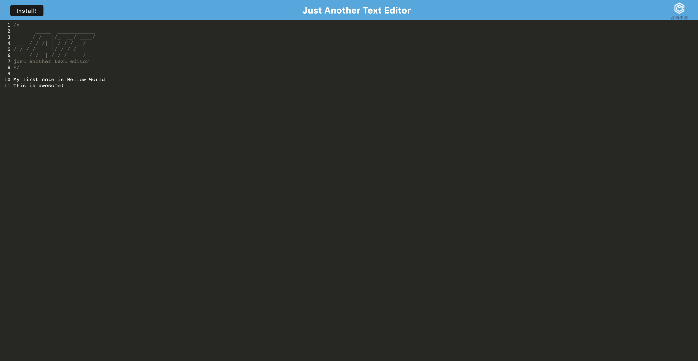

# Module19-TextEditor

## Description
          
This app is a text editor that runs in brows as well as online once downloaded. If you start taking a note while in browser, don't worry, the note will be saved and appear in the text editor once its downloaded. To download the app from your browser simply click the left install button and the app will automatically be downloaded.

[Text Editor Deployed URL](https://texteditor-pwa-sl-7ab7eb058920.herokuapp.com/)

## Technologies Used

- Javascript
- Node.js
- Express
- idb
- npm
- Heroku

## License

For more info check [MIT License](https://opensource.org/licenses/MIT)

## Questions

For any issues, please contact me at:
slenorovitz@gmail.com
 
Or check out my Github page https://github.com/GypsyBoho